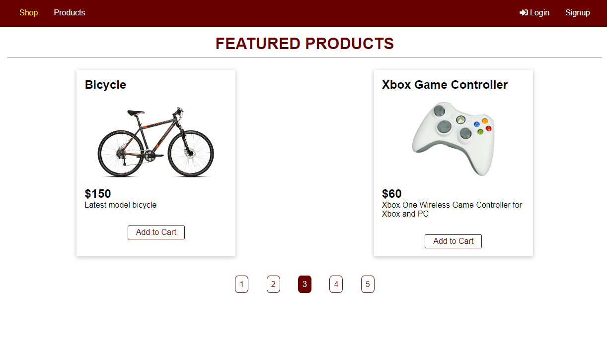
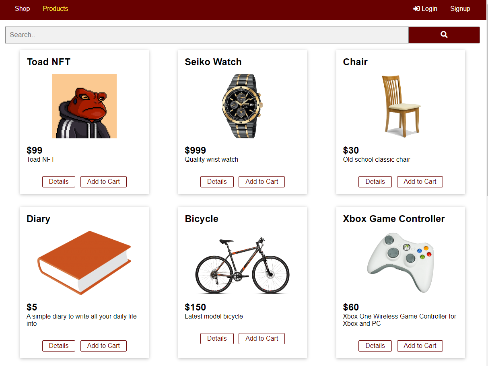
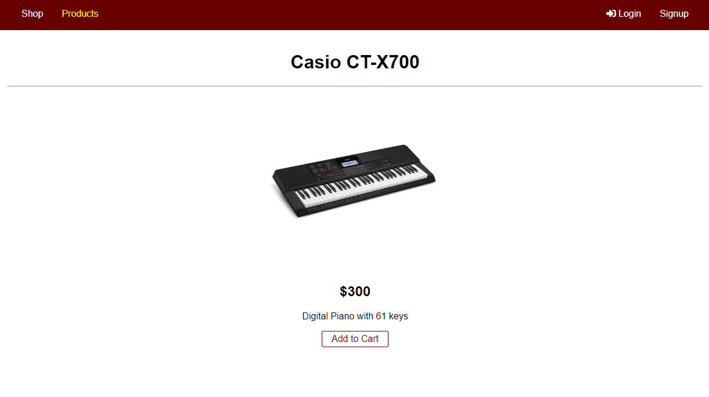
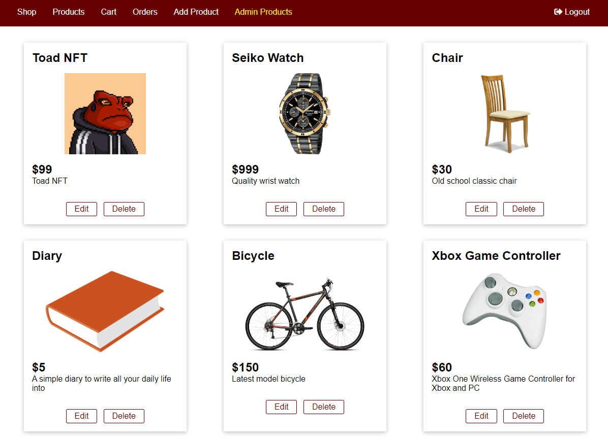
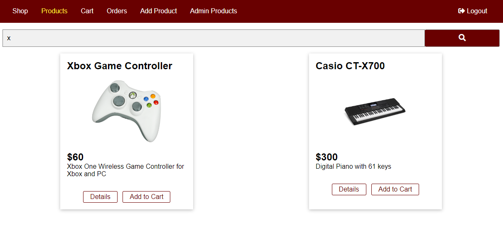
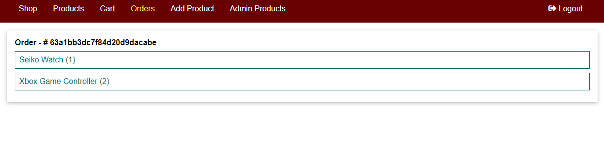

E-Commerce Web Application MVC
================

General Info
------------
> This project is a dynamic e-commerce web application done in NodeJS with MVC design.  
> Using: NodeJS, Express, EJS, MongoDB, Mongoose, Authentication, CSRF Tokens, Validators, Nodemailer, BCrypt

### Features
* View the featured products on the home page with *pagination*.
* View all listed products on the products page and search for any keyword in the product titles.
* Login / Register to have access adding, editing and deleting listed products via admin panels.
* Authorization, locking some routes for unauthorized and using CSRF tokens for safety.
* Add or remove products from your cart. Order and see the orders list.
* NoSQL Database system using MongoDB, Mongoose

### How To Use
> #### What You Need
> Make sure port 3000 isn't in use.  
> Make sure you have Node installed on your computer.

#### RUN VIA TERMINAL
* Download or clone this repository to your computer.
* Open your preferred terminal and go to the directory this project is in.
* Type npm install and then type npm start
* Once the app runs, open your browser and type http://localhost:3000 as the url. You'll get redirected to the login page.
* You can register, then login.
* Add or remove products from your cart, order, view products in detail, search through all the listed products and logout. 

### Screenshots

> Main page, featured items and pagination 
> Products page where all products are listed 
> Product details page 
> Manage products 
> Add product   
> Search for products 
> Cart page 
> Orders page 
